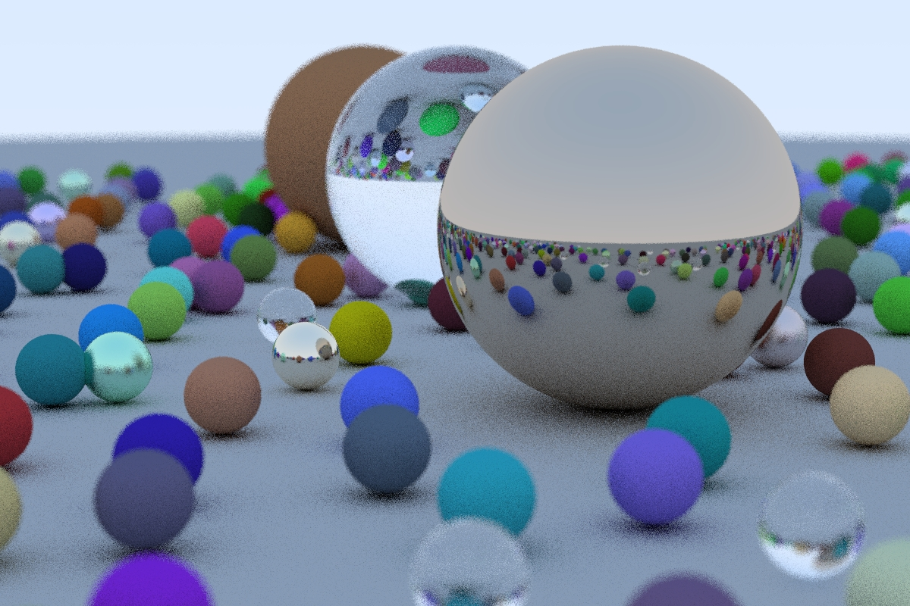

Ray Tracing in One Weekend
====================================================================================================



## Changes
- CMake project & build support
- Visual Studio compile fixes
- simple "stdout progress bar", simple chrono time measurement, save output ppm directly to file
- command line arguments for render parameters/configuration
- OpenMP support for multicore processing

## Configure, build and run
```
git clone https://github.com/Woking-34/raytracinginoneweekend.git rtow
cd rtow
mkdir rtow-build
cd rtow-build
cmake .. -G"Visual Studio 15 2017 Win64"
cmake --build . --target rtow --config Release

cd ..
cd rtow-bin
cd Release
rtow.exe --width 600 --height 400 --ns 16
Rendering 100.00%
Render time: 24.0868 sec
Saving result to out.ppm
Done!
```
