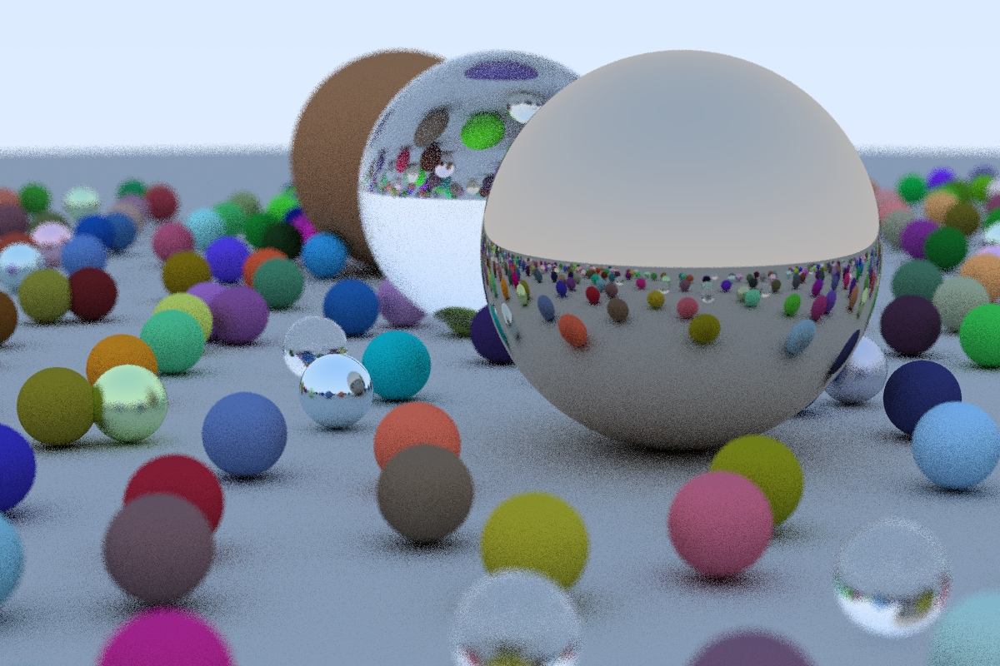

# Ray Tracing in One Weekend



## Changes
- CMake project & build support
- MSVC compatibility fixes
- simple "stdout progress bar", simple chrono time measurement, save output ppm directly to file
- command line arguments for render parameters/configuration
- OpenMP support for multicore processing

## Configure, build and run
```
git clone https://github.com/Woking-34/raytracinginoneweekend.git rtow
cd rtow
mkdir rtow-build && cd rtow-build
cmake .. -G"Visual Studio 15 2017 Win64"
cmake --build . --target rtow --config Release

cd ../rtow-bin/Release
rtow_ch12.exe --width 600 --height 400 --ns 16
Render width: 600
Render height: 400
Number of samples per pixel: 16

omp_get_max_threads: 8

Rendering 100.00%
Render time: 10.6925 sec
Saving result to out.ppm
Done!
```

## References
 - [petershirley - raytracinginoneweekend](https://github.com/petershirley/raytracinginoneweekend)
 - [rogerallen - raytracinginoneweekendincuda](https://github.com/rogerallen/raytracinginoneweekendincuda)
